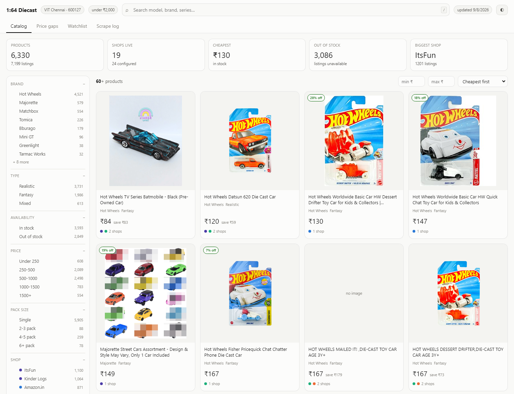
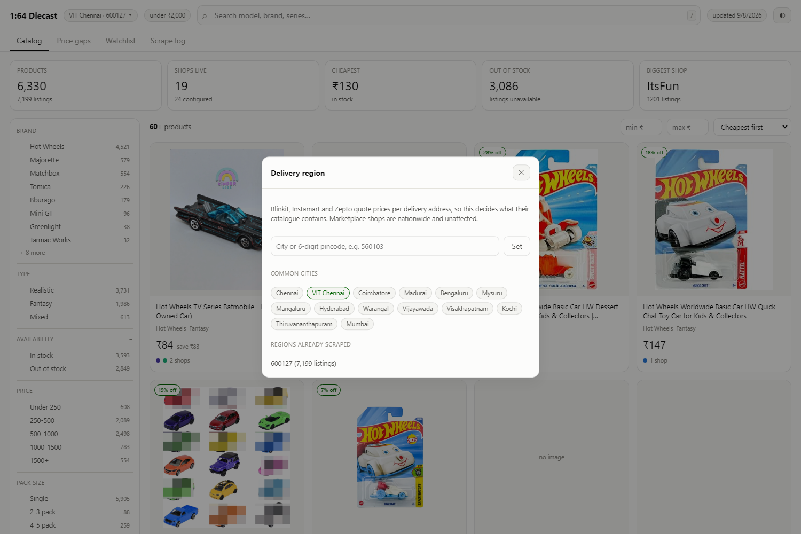
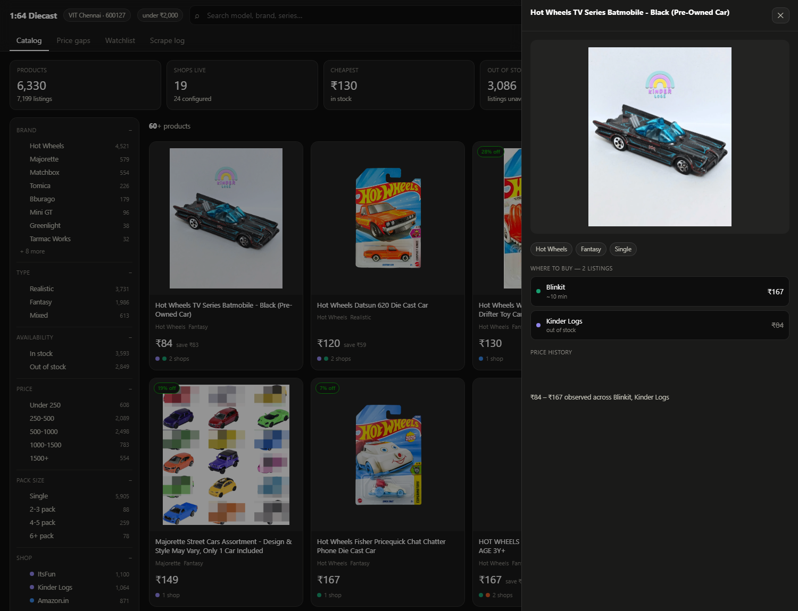

<div align="center">

# Diecast Dashboard

**One price dashboard for 1:64 diecast across Indian marketplaces, quick-commerce apps and specialty collector shops.**

Finds the same model everywhere it is sold, tells you which shop is cheapest,
and remembers what it used to cost.

[](https://github.com/Preygle/diecast-dashboard/actions/workflows/ci.yml)
[](https://www.python.org/downloads/)
[](LICENSE)



</div>

---

## What it does

Diecast cars are sold across three very different kinds of shop, and none of
them will tell you what the others charge:

| | Examples | Why it matters |
|---|---|---|
| **Marketplaces** | Amazon.in, Flipkart, FirstCry | Widest range, wildly variable pricing |
| **Quick-commerce** | Blinkit, Instamart, Zepto | 10-minute delivery, but priced **per delivery area** |
| **Specialty shops** | Kinder Logs, ItsFun, Toy Collectors India, +14 more | Where the rare castings actually are |

This scrapes all of them, groups the *same model* across shops, and shows you
the cheapest place that will actually sell it to you today.

**Last verified run: 7,199 listings · 6,330 products · 19 live shops · 16 brands.**

### Features

- **Cross-shop matching** — one card per model, every shop's price beneath it
- **Real stock tracking** — sold-out listings are recorded, not silently dropped
- **Region-aware** — pick any Indian city or pincode; quick-commerce prices follow
- **Brand + type filters** — Hot Wheels, Matchbox, Majorette, Tomica, Mini GT…
  and **Realistic vs Fantasy** castings
- **Price history** — per-shop sparklines from every recorded change
- **Watchlist** — track a model, get flagged when it drops below your target
- **Strictly 1:64** — a Maisto 1:24 is not a price comparison for a 1:64 car

---

## Quick start

```bash
git clone https://github.com/Preygle/diecast-dashboard.git
cd diecast-dashboard

pip install -r requirements.txt
python -m playwright install chromium

python cli.py region set Chennai   # or any city / 6-digit pincode
python cli.py scrape               # first run takes ~15 min across all shops
python cli.py serve                # http://127.0.0.1:8000
```

Windows users can just double-click **`Dashboard.bat`** — it starts the server
and opens a browser once the port is actually listening.

### Docker

```bash
docker compose up -d --build                     # dashboard on :8000
docker compose run --rm scrape                   # fetch prices
```

The database and the saved browser profile live in `./data`, mounted as a
volume, so rebuilding the image never discards scraped prices.

---

## Choosing your region

Quick-commerce apps price and stock **per delivery address**, so the region is
not cosmetic — it decides what their catalogue even contains. Marketplaces and
specialty shops ship nationwide and are unaffected.

```bash
python cli.py region                       # show current region + stored data
python cli.py region list                  # 50 bundled cities
python cli.py region set Hyderabad         # by city
python cli.py region set 560103            # by pincode (looked up online)
python cli.py region set --pincode 600127 --lat 12.8406 --lon 80.1534 --label "VIT Chennai"
```

…or click the region chip in the dashboard header:



Listings are stored **per region**, and the dashboard only ever shows the
active one — so scraping a second city adds data rather than corrupting the
first. After switching, re-run `python cli.py setup <app>` for each
quick-commerce app so its saved address matches.

---

## Commands

```bash
python cli.py scrape                       # every enabled shop, every query
python cli.py scrape --fast                # the 2-minute cycle: watched brands only
python cli.py scrape --only amazon_in      # just one
python cli.py serve --port 8000            # dashboard
python cli.py region set <city|pincode>    # change delivery region
python cli.py setup zepto                  # set a quick-commerce address by hand
python cli.py regroup                      # re-derive grouping, no re-scrape
python cli.py top --limit 20               # cheapest finds in the terminal
python cli.py stats                        # per-shop summary
python cli.py watch add "treasure hunt" --target 500
python cli.py watch add "*" --brand Majorette --pack-min 1 --pack-max 1 --target 300
python cli.py alerts                       # send anything that changed
python cli.py bot poll                     # answer /commands sent to the bot
python cli.py bot commands --on pause      # enable a bot command
```

`regroup` exists because grouping rules change more often than prices do. After
editing the brand lists or `match_threshold`, rebuild from the listings already
on disk instead of re-fetching every shop.

---

## Shops

### Marketplaces & quick-commerce

| Shop | Transport | Status |
|---|---|---|
| **Amazon.in** | plain HTTP | works unattended |
| **Flipkart** | headless Chromium | 403s `httpx` even with byte-identical headers while answering curl and Chrome — it fingerprints the **TLS client**, not the headers |
| **Blinkit** | headless Chromium | location from `gr_1_lat`/`gr_1_lon` cookies; verified resolving to the configured coordinates |
| **Zepto** | headless Chromium | **needs `setup`** — accepts your GPS coordinates then queries its own API with a default store's anyway (observed answering Chennai with Bengaluru coordinates). A location check discards any run served >55 km away |
| **Instamart** | headless Chromium | **needs `setup`** — AWS WAF blocks fresh headless sessions |

### Specialty shops — one adapter, many stores

Writing a scraper per shop does not scale. Most Indian toy and diecast shops
run **Shopify** or **WooCommerce**, and both expose public JSON product APIs,
so two generic adapters cover all of them and **adding a shop is a line of
YAML**:

| Platform | Endpoint |
|---|---|
| Shopify | `/products.json?limit=250&page=N` · `/search/suggest.json?q=…` |
| WooCommerce | `/wp-json/wc/store/v1/products?search=…` |

Both return the shop's own `vendor` (brand) and `available` (stock) — better
data than any marketplace HTML.

Two modes: **`catalog`** reads the whole catalogue and filters locally (right
for a small specialist — complete, one request per 250 products); **`search`**
runs the configured queries (right for a general retailer, where paging the
catalogue means fetching 40,000 books to find ten cars).

**Live:** Kinder Logs · ItsFun · Zoomsters · Toy Collectors India · The Peppy
Store · Kidsinfy · Gift Galaxy · Blue Balloon Toys · Jaiman Toys · Krazy
Caterpillar · Toys India · FunCorp · Toycra · Toymarche · Crossword · Gbuy

Add another:

```bash
curl -sL https://SHOP.in/products.json?limit=1 | head -c 100                  # Shopify?
curl -sL https://SHOP.in/wp-json/wc/store/v1/products?per_page=1 | head -c 100  # Woo?
```

```yaml
shopify:
  stores:
    - name: myshop
      label: "My Shop"
      domain: myshop.in
      mode: catalog
```

**Not reachable this way** — custom platforms with no public product JSON, each
needing a bespoke adapter: **Karz and Dolls**, **Toyworld Jaipur**,
**Hamleys India**, **DieCast India**.

**FirstCry** is the one that got a bespoke adapter. It runs a custom ASP.NET
storefront, but its listing pages page through a JSON service that answers
plain HTTP requests:

```
/svcs/ProductFilter.svc/GetSubcategoryWisePagingProducts?CatId=5&BrandId=113
```

The service is addressable only by category and brand id — its search sibling
ignores `SearchString` and returns the entire 479k-product catalogue — so the
adapter resolves each query against `/search?q=`, which redirects to the brand
page whose hidden inputs carry the ids. Queries that land on a brand get the
full catalogue through the service; the rest fall back to the 20 cards the
search page renders server-side.

---

## How matching works

The same 5-pack is titled three different ways:

```
Amazon    Hot Wheels Basic Car 5-Pack, Multicolor, Set of 5 Toy Cars 1:64
Flipkart  HOT WHEELS 5 Car Pack Assortment (Multicolor, Pack of 5)
Blinkit   Hot Wheels 5 Car Pack
```

Cross-shop comparison is worthless unless those become one row, so
`normalize.py` strips boilerplate, extracts pack size, reduces the rest to a
sorted token signature, and fuzzy-matches it (`rapidfuzz`, threshold 87).

Three things are **hard gates** rather than inputs to the score, because
similarity cannot express them:

- **Brand** — a Matchbox Skyline is not a Hot Wheels Skyline
- **Pack size** — a single car is not a 10-pack, however similar the words
- **Numbers in the title** — "Promo 6" and "Promo 12" differ by one short token
  and score ~96, but they are different trucks

Grouping deliberately **under-merges**: a wrongly merged card invents a saving
that does not exist.

### Junk filters

Every one of these was written against a real listing that slipped through:

| Problem | Real example |
|---|---|
| Knockoffs | `BharatToys Hot Wheels **Style** Die Cast Cars` |
| Accessories | `RaceMedal Doll Collections **for Siku Matchbox Greenlight**` (3+ brands = compatibility list) |
| Word collisions | `**Big Matchbox** by Homelites` — a ₹10 box of *safety matches* |
| Keyword stuffing | `Arizuul 1:64 Dodge Challenger … **hot wheels** cars under 100` |
| Brand typos | `ZHASK All New **Hot Wheelss**` |

---

## Realistic vs Fantasy

Not the same axis as the `Mainline` series tag — that means Hot Wheels' basic
line as opposed to Premium. **Type** is about what the car *is*:

| Value | Meaning | Examples |
|---|---|---|
| **Realistic** | licensed model of a real vehicle | Nissan Skyline GT-R, '69 Camaro |
| **Fantasy** | in-house casting, no real counterpart | Twin Mill, Bone Shaker |
| **Mixed** | multipack or track set — contains both | any 5-pack |

Detection matches ~90 real marques and ~180 real models, because titles often
give only the model ("Corvette") with no manufacturer. Word boundaries matter:
"Rodger **Dodger**" must not match *Dodge*, and "**Jeep**ster Commando" is a
real Jeep a naive match would miss.

With `exclude_fantasy: true` this stops being only a label and becomes a gate:
fantasy castings are dropped at store time rather than kept and filtered later.
**Mixed** is never dropped — a 5-pack has no single answer, so multipacks and
track sets always survive. The gate lives in the pipeline, not in each adapter,
so one flag governs every shop and `regroup` re-applies it to everything
already on disk.

---

## How fast an alert reaches you

Polling has a floor, and the honest number is the cycle length plus the gap
between cycles. Three tiers, because a full sweep of every shop and every query
takes about two minutes and is the wrong thing to run at speed:

| Tier | Every | What it covers | Cycle |
|---|---|---|---|
| **fast** | 2 min | `fast_sources` × `fast_queries` — the watched brands at the shops that stock them near MRP | ~35s |
| **full** | 20 min | every enabled shop, every query | ~2 min |
| **blinkit** | 1 hour | quick-commerce, browser-driven | ~5 min |

Worst case on the fast tier is therefore under three minutes from a listing
appearing to a message arriving, against about seven and a half before.

Two things bought that. Shops already ran concurrently, so the sweep was as
long as its slowest shop — and that shop was slow because its own queries ran
strictly one after another; `Source.collect` now runs them in a small window.
And the fast tier stopped asking every shop about every collector marque:
`fast_queries` holds only the brands actually watched.

---

## Cross-checking the price

A shop's stated MRP is not a ceiling. **372 of 374 listings sit at or under
their own stated MRP**, because shops set the MRP field to whatever they are
charging — so comparing `price` to `mrp` passes everything and guards nothing.

What works is the catalogue's own view of what a class of thing costs:

| Class | Median |
|---|---|
| Hot Wheels mainline single | **₹179** |
| Hot Wheels Premium single | ₹626 |
| Hot Wheels Monster Trucks single | ₹549 |
| Majorette Premium single | ₹359 |
| Tomica single | ₹449 |

`max_markup` is how far over that median an item may sit and still be worth a
message. At `0.25` a ₹179 mainline alerts up to about ₹224 — a little over is
fine — and a ₹358 one (100% over) is not sent.

A class needs at least five in-stock listings before it is trusted as a
baseline; below that nothing is judged, so a thin brand never produces false
rejections. Judging happens against the item's own class, so a genuinely
expensive Premium is not mistaken for an overpriced mainline.

Like muting, this suppresses **delivery only**. The listing is still stored,
still shown in the dashboard for comparison, and still remembered — so if it
later drops to a sane price you hear about the drop rather than nothing.

---

## The Telegram bot

Alerts push; the bot also answers. Commands arrive through `getUpdates` rather
than a webhook, because there is no always-on listener here — `cli.py bot poll`
runs in the same scheduled cycle as the scraper, so a command is answered a few
minutes after it is sent.

Eight commands ship enabled:

| | |
|---|---|
| `/help` | what the bot can do (cannot be switched off) |
| `/status` | pipeline health and per-shop counts |
| `/filter [off\|on\|reset] [shop…]` | mute or unmute shops |
| `/find <text>` | search the catalogue |
| `/deals` | biggest price gaps between shops |
| `/watch` | your watch rules and what they match |
| `/stock` | what is out of stock, per shop |
| `/photos [on\|off]` | product photos in alerts |

Seven more ship **off** — `/pause`, `/resume`, `/top`, `/stats`, `/region`,
`/history`, `/commands` — and are switched on from the dashboard's **Bot** tab,
or with `/commands on pause` once that one is enabled.

A disabled command is not merely refused: it is left out of `/help` and out of
the menu Telegram shows, so the bot never advertises something it will not do.
Toggling one re-pushes that menu.

### Photos

A title like *"Hot Wheels HW Torque Free Wheel Die Cast"* identifies nothing —
the picture is what tells you which casting it is. Alerts carry one, taken from
the listing rather than the product, so you see the shop's own photo.

| Batch | What arrives |
|---|---|
| 1 with a photo | one captioned picture |
| 2–10 with photos | one album, each captioned |
| more than 10 | the full text digest, plus an album of the first 10 |

Captions carry the price, the shop and the link, so a batch that fits in one
album needs no text message at all.

Images are requested at 320px where the CDN can resize from the URL — Shopify
via `&width=`, Blinkit via Cloudflare's `/cdn-cgi/image/`, FirstCry via its
size path segment. That is 632KB → 24KB for a Blinkit photo. Telegram
re-compresses anyway, so the gain is that it fetches fast and never meets its
10MB limit on a source image.

Any failure in the picture path falls back to the text digest: a photo is a
nicety, a missed restock is not. `/photos off` (or the Bot tab) for text only.

### What `target_price` does

It gates **price drops only**. A new listing or a back-in-stock alert fires
whatever the price, so a rule reading "Hot Wheels · realistic · single ·
target ₹300" still messages you about a ₹1,495 one when it first appears. The
target is what a drop is measured against — a listing falling from above it to
at-or-below it — not a ceiling on the rule.

If you want a ceiling, that is a different change; the rule filters are brand,
realism, series, pack size, shop and stock.

### Delivery log

`alert_state` records what the watcher *saw*. That is not the same as what it
*sent*: a run can evaluate cleanly and still fail to deliver, and there was no
way to tell the two apart — "did it alert me on Tuesday?" could only be
inferred. `notify_log` records every delivery attempt: when, which channel,
what shape went out, how many alerts, and whether it succeeded.

`/status` reports the last send and a seven-day tally; the Bot tab shows the
full table.

### Muting

`/filter off blinkit` stops Blinkit alerts. The shop is still scraped and still
appears in the dashboard — only the messaging stops. Muting is applied *after*
evaluation, never before, because alert state has to keep advancing while a
shop is quiet; otherwise unmuting would dump every change that happened in the
meantime. The same holds for `/pause`: you get the next change, not the backlog.

---

## Out-of-stock listings

Sold-out items are **collected and shown**, not filtered away — an item you
cannot buy today is still worth knowing about.

The catch: a sold-out listing usually renders with **no price at all**, so
`listings.price` is nullable and three states are distinguished:

| Shown | Meaning |
|---|---|
| `₹499` | in stock at that price |
| `— out of stock` | listed, not currently sold |
| `— see options` | Amazon variation parent; price depends on the variant |

That last distinction matters: calling a variation parent "out of stock" would
be wrong. `MIN(price)` skips NULLs so an unpriced offer never becomes a "best
price", price caps never hide unpriced rows, and price sorts lead with what you
can actually buy.



---

## Architecture

```
hotwheels/
├── config.py       config + env overrides (HOTWHEELS_DB, HOTWHEELS_CONFIG)
├── regions.py      city/pincode → coordinates, 50 bundled + online lookup
├── db.py           SQLite schema, migrations, upserts
├── normalize.py    brand/scale/pack/realism detection + fuzzy matching
├── pipeline.py     scrape orchestration, grouping, regroup
├── queries.py      read-side queries, facets, region scoping
├── server.py       FastAPI: JSON API + dashboard
├── cli.py          command line
└── sources/
    ├── base.py         Source contract, HTTP + browser helpers
    ├── amazon_in.py    HTML parsing
    ├── flipkart.py     Chromium (TLS fingerprinting)
    ├── quickcom.py     Blinkit / Instamart / Zepto
    ├── shopify.py      generic — any Shopify store
    └── woocommerce.py  generic — any WooCommerce store
```

**Data model:** `products` are derived, `listings` are the raw record. That is
why `regroup` can rebuild grouping offline without re-scraping.

- `products` — one real item (a car, a pack, a track set)
- `listings` — one shop's offer; unique on `(source, sku, region)`
- `price_history` — appended **only when a price moves**
- `watchlist`, `scrape_runs` — tracked models and a per-shop audit log

---

## Tests

```bash
python tests/test_normalize.py   # brands, 1:64 gate, packs, realism, matching
python tests/test_regroup.py     # regroup must never destroy listings
python tests/test_stock.py       # out-of-stock + nullable-price migration
python tests/test_alerts.py      # transitions, seeding, HTML escaping
python tests/test_firstcry.py    # both FirstCry shapes: service JSON and cards
python tests/test_bot.py         # command toggles, muting, the keep policy
```

No Playwright browsers needed — the suite is pure logic. CI runs it on Python
3.11, 3.12 and 3.13.

---

## Configuration

`config.yaml`:

```yaml
region:            # use `cli.py region set`, not hand edits
  pincode: "600127"
  lat: 12.8406
  lon: 80.1534
max_price: null         # a ceiling at parse time; null means no ceiling
exclude_fantasy: true   # mainlines only — drop in-house castings
max_markup: 0.25        # reject alerts priced >25% over their class median
queries: [...]          # search terms fanned out to every shop
fast_queries: [...]     # the subset polled on the 2-minute cycle
fast_sources: [...]     # the shops polled on the 2-minute cycle
scrape:
  match_threshold: 87   # raise to split more, lower to merge more
  headless: true
  delay: 1.5            # seconds between requests, plus jitter
```

---

## Caveats

- **Scrapers break.** These sites redesign without warning. Parsing is
  deliberately structural (data attributes, `/p/itm` links, JSON walks) rather
  than class-name based, but nothing is immune.
- **Prices are point-in-time**, captured when you last scraped. Always confirm
  on the retailer's page before buying.
- **Out-of-stock ratios come from the shop's own flag.** A collector shop
  listing every car it ever stocked will legitimately show most as sold out.
- **Be polite.** The default 1.5s delay plus jitter exists for a reason;
  hammering these endpoints gets your IP blocked.
- This is a personal price-tracking tool. Check each site's terms before
  running it at scale.

## License

MIT — see [LICENSE](LICENSE).
